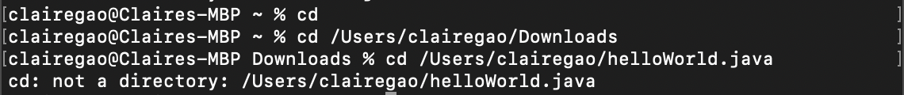
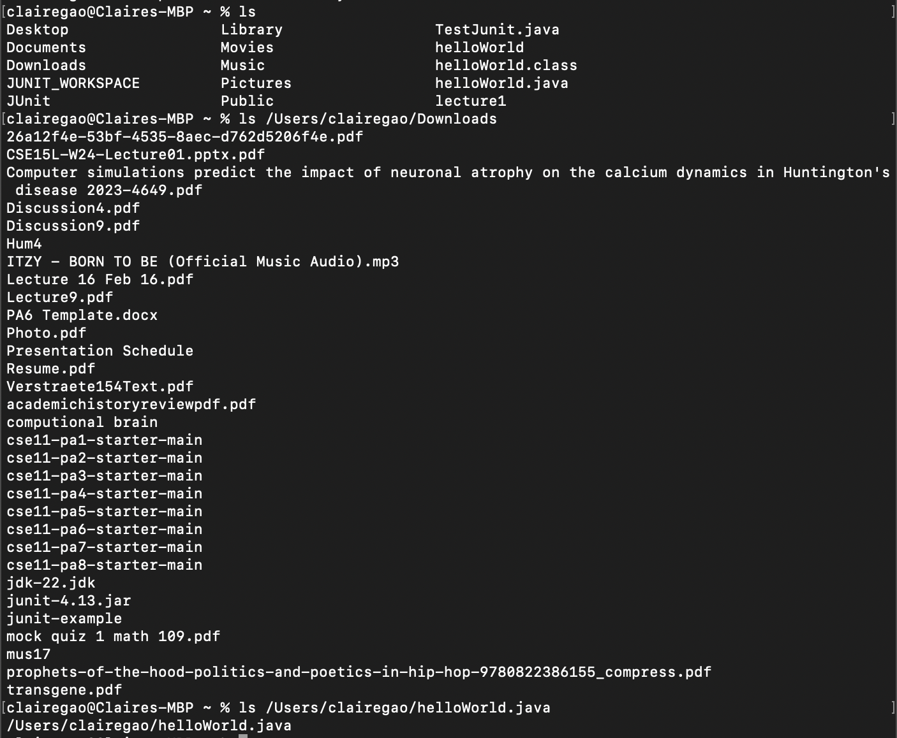
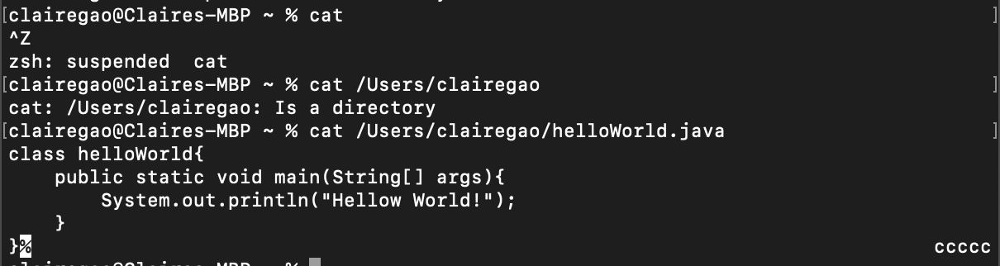

Claire Gao
<h1> Lab Report 1 </h1>
<h3>1. `cd` </h3>

<h4>1.1 `cd` without argument:</h4>
the absolute path to the working directory right before was `/Users/clairegao`. 
There is no output. That's because `cd` without argument will change directory back to home directory which is `/Users/clairegao`.  
This output is not an error.

<h4>1.2 `cd` with a path to directory:</h4>
the absolute path to the working directory right before was `/Users/clairegao`. 
there is no output. However, the directory is now changed to <code>/Users/clairegao/Downloads</code>. 
there is no error.

<h4>1.3 <code>cd</code> with a path to file:</h4>
the the absolute path to the working directory right before was <code>/Users/clairegao/Downloads</code>.
there is an error. That's because <code>cd</code>  is to change directory, and if we provide the path to a file, which is not a directory, it will cause an error. 
   
<h3>2. <code>ls</code></h3>
   
   

<h4>2.1 <code>ls</code> without argument:</h4>
the absolute path to the working directory right before was <code>/Users/clairegao</code>. 
the output is all the files and directories under a the currect directory. 
This output is not an error.

<h4>2.2 <code>ls</code> with a path to directory:</h4>
the absolute path to the working directory right before was <code>/Users/clairegao</code>.  
Since the command after <code>ls</code> is <code>/Users/clairegao/Downloards</code>. the output lists all the files under the directory is <code>/Users/clairegao/Downloards</code>.  
there is no error.

<h4>2.3 <code>ls</code> with a path to file:</h4>
the absolute path to the working directory right before was <code>/Users/clairegao</code>.  
When we provide a path to a file, <code>ls</code> will display the path to the specific file.  
There is no error.

<h3>3. <code>cat</code> </h3>

   

<h4>3.1 <code>cat</code>  without argument:</h4>
the absolute path to the working directory right before was <code>/Users/clairegao</code>.  
there is no output if <code>cat</code> is not followed with any argument. That's because <code>cat</code> will concatenate and display the content of files. If there are no commands follow <code>cat</code>, the terminal will wait for input. We quit will <code>ctrl</code> + <code>z</code>.  
This will not cause an error although the terminal will wait for input.

<h4>3.2 <code>cat</code>  with a path to directory:</h4>
the absolute path to the working directory right before was <code>/Users/clairegao</code>.  
The output saying that the commands followed  <code>cat</code> is an directory.  
Since <code>cat</code> is to concatenate files, there would be an error if commands is a path to directory.

<h4>3.3 <code>cat</code>  with a path to file:</h4>
the absolute path to the working directory right before was <code>/Users/clairegao</code>.  
The output is the file content. That's because when we provide a path to a file, <code>cat</code> will the content of the specific file.  
There is no error
