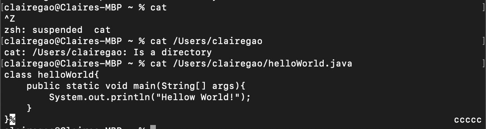

Claire Gao
	<h1>Lab Report 1</h1>
<h3>1. cd</h3>

<h4>1.1 cd without argument:</h4>
the absolute path to the working directory was <code>/Users/clairegao</code>. 
there is no output. That's because `cd` is to change directory to the command after and if we put nothing after cd, the directory would not be changed.  
This output is not an error.

<h4>1.2 cd with a path to directory:</h4>
the absolute path to the working directory was `/Users/clairegao`.
there is no output. However, the directory is now changed to `/Users/clairegao/Downloads`
there is no error.

<h4>1.3 cd with a path to file:</h4>
the the absolute path to the working directory was `/Users/clairegao/Downloads`
there is an error. That's because 'cd' is to change directory, and if we provide the path to a file, which is not a directory, it will cause an error. 
   
<h3>2. ls</h3>
   
   

<h4>2.1 ls without argument:</h4>
the absolute path to the working directory was `/Users/clairegao` 
there is no output. That's because `cd` is to change directory to the command after and if we put nothing after cd, the directory would not be changed. 
This output is not an error.

<h4>2.2 ls with a path to directory:</h4>
the absolute path to the working directory was `/Users/clairegao`
there is no output. However, the directory is now changed to `/Users/clairegao/Downloads`
there is no error.

<h4>2.3 ls with a path to file:</h4>
the the absolute path to the working directory was `/Users/clairegao/Downloads`
there is an error. That's because 'cd' is to change directory, and if we provide the path to a file, which is not a directory, it will cause an error. 

<h3>3. cat</h3>

   
