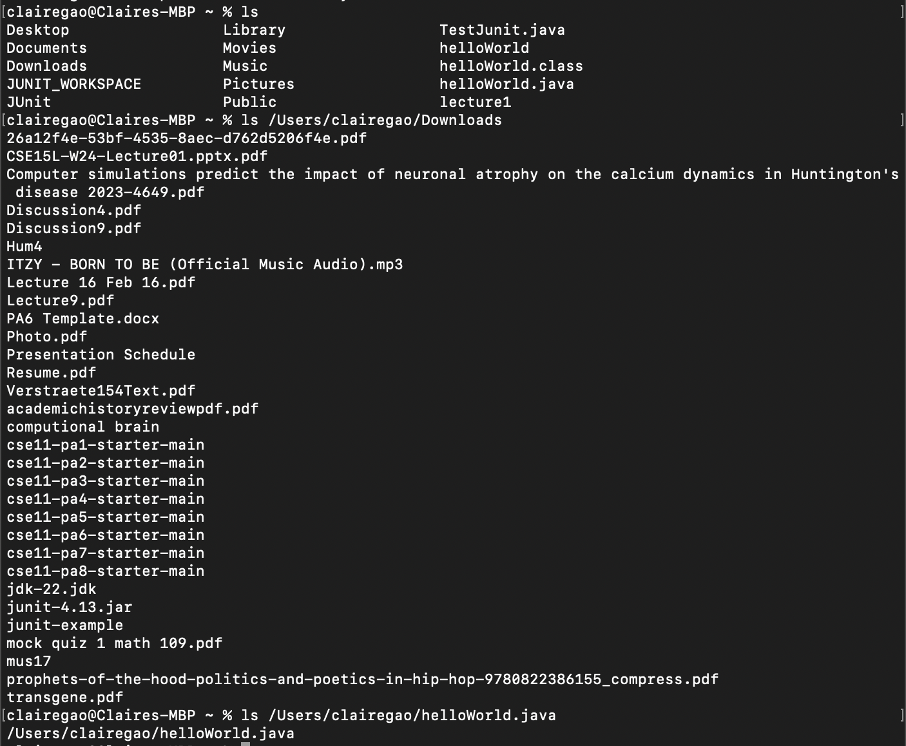

Claire Gao
	<h1>Lab Report 1</h1>
1. cd
   
What the absolute path to the working directory was right before the command was run.
A sentence or two explaining why you got that output (e.g. what was in the filesystem, what it meant to have no arguments).
Indicate explicitly whether the output is an error or not, and if it's an error, explain why it's an error in one or two sentences. Note: Make sure to use backticks ` around keywords such as commands, file names, paths, etc. to make them show up as code like cd.

1.1 cd without argument:
the absolute path to the working directory was /Users/clairegao
there is no output. That's because `cd` is to change directory to the command after and if we put nothing after cd, the directory would not be changed. 
This output is not an error.

1.2 cd with a path to directory:
the absolute path to the working directory was `/Users/clairegao`
there is no output. However, the directory is now changed to `/Users/clairegao/Downloards`

   
3. ls
   
4. cat
   
