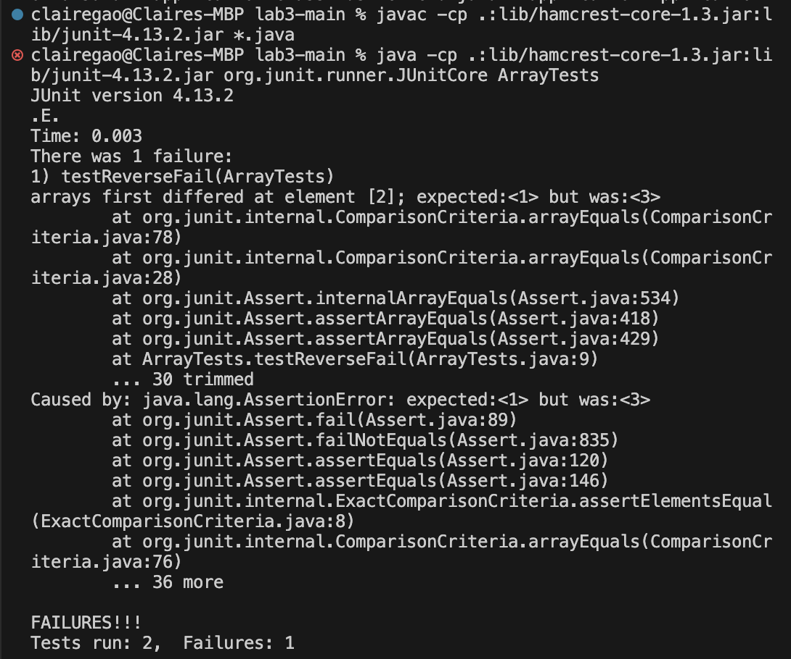

<h1>Lab Report 3</h1>

<h2>Part one</h2>

The input that induces failures :
```
public class ArrayTests {
	@Test 
	public void testReverseFail() {
    		int[] input1 = {1,2,3};
    		ArrayExamples.reverseInPlace(input1);
    		assertArrayEquals(new int[]{3,2,1}, input1);
	}
}
```

The input does not induce failure:

```
public class ArrayTests {
@Test
	public void testReversedPass() {
    		int[] input2 = {0};
    		assertArrayEquals(new int[]{0}, ArrayExamples.reversed(input2));
  	}
}
```

The symptop: 


Bug:
```
static int[] reversed(int[] arr) {
    int[] newArray = new int[arr.length];
    for(int i = 0; i < arr.length; i += 1) {
      arr[i] = newArray[arr.length - i - 1];
    }
    return arr;
  }
```

Debug:
```
static int[] reversed(int[] arr) {
    int[] newArray = new int[arr.length];
    for(int i = 0; i < arr.length; i += 1) {
      newArray[i] = arr[arr.length - i - 1];
    }
    return newArray;
  }
```
In the previous code, it creates a new array, but assigning the values in the new array to arr and return it. Since the new array is empty, the return value would also be empty, so it would not work. In my fixing, I instead assign the values of the input array reversely to the new array and return the new array. 

<h2>Part two</h2>

command `find`: </n>
the basic syntax is `find [location] [option] [search term]` 
</n>

Option 1: `-name` 
<br>
this is used to find the files with its name containing the search term.

```
clairegao@Claires-MacBook-Pro docsearch % find ./technical -name "reporting_system.txt"
./technical/government/About_LSC/reporting_system.txt
clairegao@Claires-MacBook-Pro docsearch % find ./technical -name "chapter-11.txt"      
./technical/911report/chapter-11.txt
```
<br>
the first commands search for files named "reporting_system.txt" under the directory docsearch/technical. And return the directory of the files.
<br>
the second commands search for files named "chatper-11.txt" under the directory docsearch/technical. And return the directory of the files. 
<br>


Option 2: `-type`
 <br>

this is used to find the files with the specified type

for example, `-type d` searches for the directory. 
```
clairegao@Claires-MacBook-Pro docsearch % find ./technical -type d
./technical
./technical/government
./technical/government/About_LSC
./technical/government/Env_Prot_Agen
./technical/government/Alcohol_Problems
./technical/government/Gen_Account_Office
./technical/government/Post_Rate_Comm
./technical/government/Media
./technical/plos
./technical/biomed
./technical/911report
```
<br>
this command finds the directory under the directory `docsearch/technical`.
<br>

Another example is `-type f`, which find the files under the directory `docsearch/technical`.
```
clairegao@Claires-MacBook-Pro docsearch % find ./technical -type f -name "*.java"
```
 <br>
 Since there is no java files, the terminal return nothing 
<br>
<br>


Option 3: `-atime`
 <br>
this commands find the files that has been accessed with the given amount of period

for example, this command find files in `docsearch/technical` that was last accessed more than 1 day ago.
```
clairegao@Claires-MacBook-Pro ~ % find ./technical -atime +1
./technical
./technical/government
./technical/government/About_LSC
./technical/government/About_LSC/LegalServCorp_v_VelazquezSyllabus.txt
./technical/government/About_LSC/Progress_report.txt
./technical/government/About_LSC/Strategic_report.txt
./technical/government/About_LSC/Comments_on_semiannual.txt
./technical/government/About_LSC/Special_report_to_congress.txt
./technical/government/About_LSC/CONFIG_STANDARDS.txt
./technical/government/About_LSC/commission_report.txt
./technical/government/About_LSC/LegalServCorp_v_VelazquezDissent.txt
./technical/government/About_LSC/ONTARIO_LEGAL_AID_SERIES.txt
./technical/government/About_LSC/LegalServCorp_v_VelazquezOpinion.txt
./technical/government/About_LSC/diversity_priorities.txt
./technical/government/About_LSC/reporting_system.txt
./technical/government/About_LSC/State_Planning_Report.txt
./technical/government/About_LSC/Protocol_Regarding_Access.txt
./technical/government/About_LSC/ODonnell_et_al_v_LSCdecision.txt
./technical/government/About_LSC/conference_highlights.txt
./technical/government/About_LSC/State_Planning_Special_Report.txt
./technical/government/Env_Prot_Agen
./technical/government/Env_Prot_Agen/multi102902.txt
./technical/government/Env_Prot_Agen/section-by-section_summary.txt
./technical/government/Env_Prot_Agen/jeffordslieberm.txt
./technical/government/Env_Prot_Agen/final.txt
./technical/government/Env_Prot_Agen/ctf7-10.txt
./technical/government/Env_Prot_Agen/ctf1-6.txt
./technical/government/Env_Prot_Agen/ro_clear_skies_book.txt
./technical/government/Env_Prot_Agen/ctm4-10.txt
./technical/government/Env_Prot_Agen/1-3_meth_901.txt
./technical/government/Env_Prot_Agen/atx1-6.txt
```

this command find files in `docsearch/techcnical` that was last accessed less than 1 day ago.
```
clairegao@Claires-MacBook-Pro ~ % find ./technical -atime -1
./technical/government/Media/Volunteers_Step_Up.txt
./technical/government/Media/Wilmington_lawyer.txt
./technical/biomed/1471-2202-2-16.txt
./technical/biomed/1471-2202-4-3.txt
./technical/911report/chapter-13.5.txt
```
 <br>
  <br>
  
Option 4: `maxdepth`
<br>
this is command find files but limit subdirectory traversal to 2 levels beneath the given directory.</n>

For example, this command find txt files, but limit subdirectory traversal to 1 level beneath `docsearch/technical` directory. 
```
clairegao@Claires-MacBook-Pro docsearch % find ./technical -maxdepth 1 -name '*.txt' 
```
Since there is no txt files 1 level beneath ./technical directory, the terminal returns nothing.
<br>

this command find files or directories with name biomed , but limit subdirectory traversal to 2 levels beneath `docsearch/technical` directory
```
clairegao@Claires-MacBook-Pro docsearch % find ./technical -maxdepth 1 -name 'biomed'
./technical/biomed
```
Here it returns the directory.

source: 
1. https://snapshooter.com/learn/linux/find#basic-syntax
2. https://www.computerhope.com/unix/ufind.htm#examples

