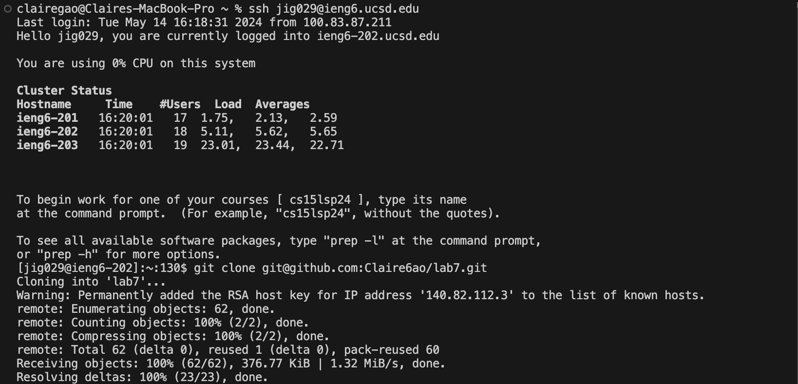
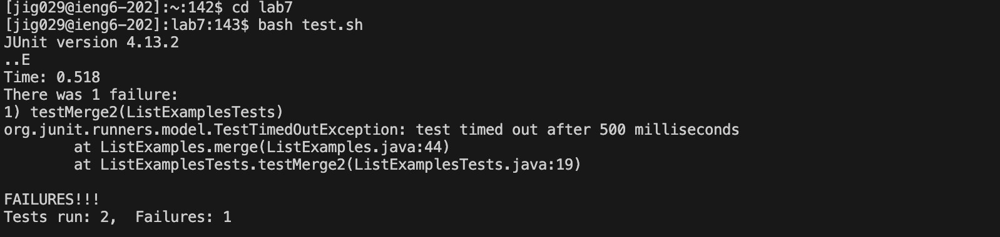
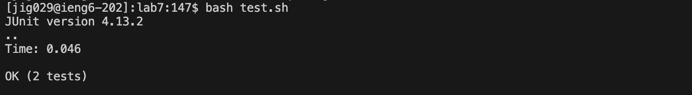
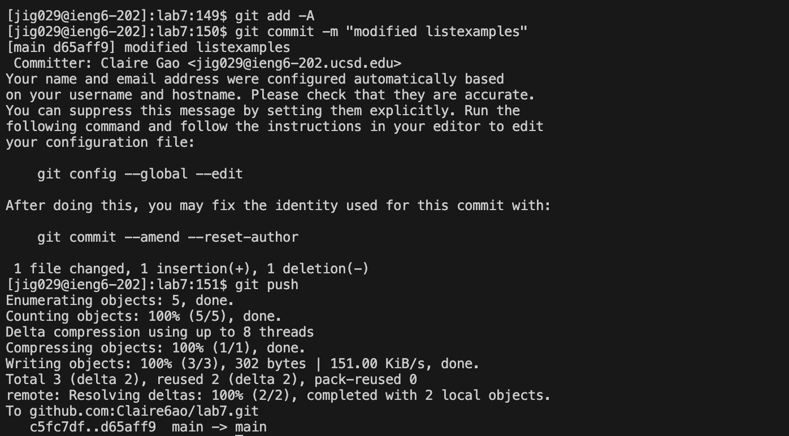

<h1>Lab Report4</h1>

<h3>step 4</h3>

I use ssh to login to my ieng account Using the code `ssh jig029@ieng6.ucsd.edu`. 

<h3>step 5</h3>

I then git clone my fork my repository by using the code `git clone git@github.com:Claire6ao/lab7.git`. 

<h3>step 6</h3>

To run the test, I first change my directory to lab7 by using the code `cd lab7`.  
I then run the test by using the code `bash test.sh`.  
The terminal shows that the test has failed. 

<h3>step 7</h3>

To correct the code, I first enter the vim. I then press `down` 26 times, and then press `right`.  
I then press `i`, then delete 1 and type 2. 
I then press `esc`. Then, I type `:wq`. In this way, I exit vim. 
 

<h3>step 8</h3>

To rerun the test, I type `bash test.sh` in the terminal. And the terminal shows all the tests haved passed. 

<h3>step 9</h3>

I then type `git add -A` in the terminal to stage the changes. Then I type `git commit -m "modified listexamples"` to commit the changes I have made. I then type `git push ` to push the changes to my github repository. 

