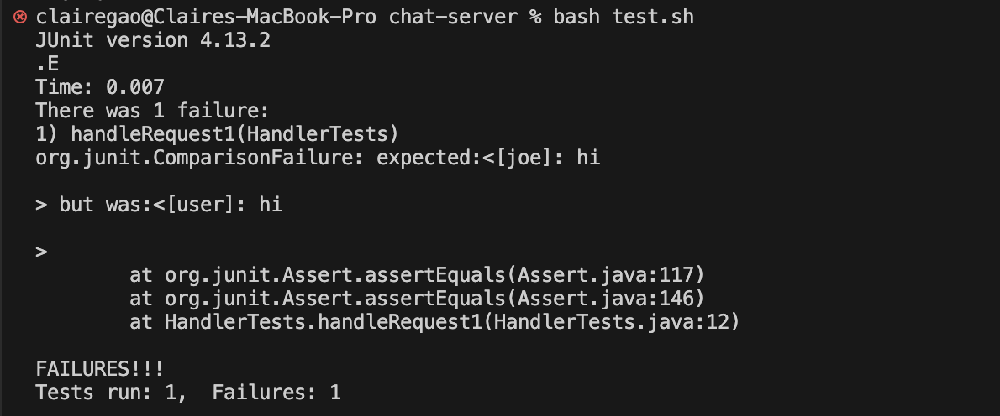

<h1> Lab Report 5 </h1>

<h3>Part 1</h3>
1. Student's post about the bugs:  

 

When I ran the test scripts, there is one failure about the test. The expected value dismatched the actual output. I doubled checked the testing method, it should be correct, so I think the failure-inducing input should be my handleRequest Method. Here is the screen shot of my code.

2. TA's response:
In your method, you are returning this.chatHistory. This variable is defined by adding user + ": " + message + "\n\n". Look at your symptom. It is saying expecting edward 
3. After fixing

4. 
