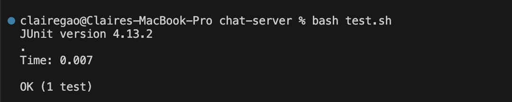

<h1> Lab Report 5 </h1>

<h3>Part 1</h3>
1. Student's post about the bugs:  

 

When I ran the test scripts using bash, there is one failure about the test. The expected value dismatched the actual output. I doubled checked the testing method and the bash script, they should be correct, so I think the failure-inducing input should be my handleRequest Method. Here is the screen shot of my code.

2. TA's response:  
Hi, you are right that both your test method and your bash scripts are correct. So the bugs-inducing input should be in your method. In your method, you are returning `this.chatHistory`. This variable is defined by adding `user + ": " + message + "\n\n"`. Look at your symptom. It is saying expected `joe: hi`, but was `user: hi`. You can take at a look at which variable is different in the expected and actual output. And then try to see if there is anything wrong within the implementation of the variable. 

3. After fixing:  

Thank you so much! I realize the implementation of the variable `user` was wrong. It should be the second String in the arraylist instead of the first String. Therefore, the index on line 18 should be one instead of zero. 

<h3>Part 2</h3>
In the lab, I learned a lot from my tutor Shreyya. She is so helpful and she explain every concept clearly and logically. I think it is really important to truely understand the deep principle about each concept before doing the physical coding work, so I always asking her about the concept and explaining what we are doing for each step, the consequences of each commands, the use of each word, etc. It is really a helpful way for me to truely learn and study.
